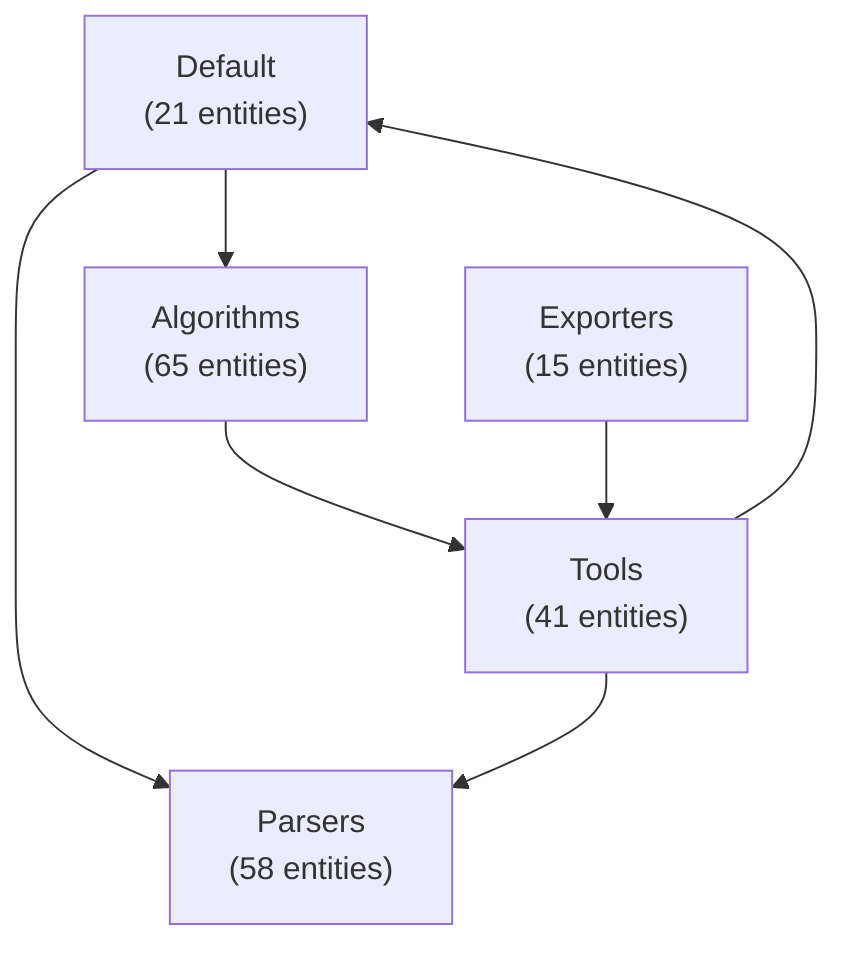

# arcade-analyze-skill

A [Claude Code](https://claude.com/claude-code) skill that recovers and
**visualizes the architecture** of a software codebase using
[arcade-agent](https://github.com/lemduc/arcade-agent) — the Python successor to
USC's ARCADE workbench (Architecture Recovery, Change, And Decay Evaluator).

Point it at a Java / Python / C / C++ / TypeScript / JavaScript / Go project
(local path or git URL) and it runs the full pipeline — **ingest → parse →
recover → detect smells → compute metrics → visualize** — then opens an
interactive HTML report with the component diagram, dependency graph,
architectural smells, and quality metrics.

## Demo

Two real runs, both with the default `pkg` algorithm, generated by
[`examples/run_demo.sh`](examples/run_demo.sh). They show the skill across
languages — and the contrast between a clean codebase and a tangled one.

| Target | Language | Entities | Edges | Components | Smells | RCI | TurboMQ | Report |
|--------|:--------:|---------:|------:|-----------:|-------:|----:|--------:|--------|
| [arcade-agent](https://github.com/lemduc/arcade-agent) (self) | Python | 200 | 115 | 5 | 3 | **0.85** | **0.79** | [HTML](examples/arcade-agent-python.html) · [live](https://lemduc.github.io/arcade-analyze-skill/arcade-agent-python.html) |
| [arcade_core](https://github.com/usc-softarch/arcade_core) | Java | 1078 | 3520 | 13 | 6 | 0.40 | 0.26 | [HTML](examples/arcade-core-java.html) · [live](https://lemduc.github.io/arcade-analyze-skill/arcade-core-java.html) |

**Read the numbers:** arcade-agent (Python) scores high on RCI/TurboMQ — cohesive,
well-separated modules. arcade_core (Java) scores much lower and surfaces a
**9-component dependency cycle** plus a hub (`Clustering`) that 58% of components
depend on — the classic signature of a large research codebase that grew
organically.

### Architecture diagram (arcade-agent, Python)

Recovered components and their dependencies. Note the cycle
`Default → Algorithms → Tools → Default` that the skill flags as a smell:



The interactive HTML report renders this diagram, the full component/entity
breakdown, every smell with its explanation, and all six metrics. **View it live:**
<https://lemduc.github.io/arcade-analyze-skill/>

### Reproduce it

```bash
ARCADE_AGENT_HOME=/path/to/arcade-agent \
ARCADE_CORE_HOME=/path/to/arcade_core \
  ./examples/run_demo.sh
```

(`ARCADE_CORE_HOME` is optional — clone
[arcade_core](https://github.com/usc-softarch/arcade_core) to include the Java run.)

## What it does

- **Recovers** a component-level architecture via clustering (PKG, WCA, ACDC,
  ARC, LIMBO).
- **Detects** architectural smells: dependency cycles, concern overload,
  scattered functionality, link overload.
- **Computes** quality metrics: RCI, TurboMQ/BasicMQ, intra/inter-connectivity.
- **Visualizes** everything in a self-contained interactive HTML report
  (auto-opened), with optional Mermaid component diagrams.

## Install

This skill is a thin wrapper over `arcade-agent`, so you need that installed
first.

1. Install [arcade-agent](https://github.com/lemduc/arcade-agent) and create its
   virtualenv (`pip install -e ".[dev]"`).
2. Make this skill discoverable by Claude Code by symlinking it into your skills
   directory (the symlink name becomes the skill name `arcade-analyze`):

   ```bash
   git clone https://github.com/lemduc/arcade-analyze-skill.git
   ln -s "$(pwd)/arcade-analyze-skill" ~/.claude/skills/arcade-analyze
   ```

3. Tell the skill where arcade-agent lives (the scripts check `--arcade-home`,
   then `$ARCADE_AGENT_HOME`, and error out with guidance if neither is set):

   ```bash
   export ARCADE_AGENT_HOME=/path/to/arcade-agent
   ```

## Usage

In Claude Code, just ask in natural language — the skill triggers on requests
like "analyze the architecture of `/path/to/repo`", "compare PKG vs WCA on this
project", "what changed architecturally since v1.0?", or "explain the Clustering
component". The skill picks the right workflow below.

Each workflow is a script run with arcade-agent's venv interpreter. `<source>`
is a local directory **or a git URL** (cloned for you).

### 1. Analyze — one codebase → static HTML report (the default)

```bash
"$ARCADE_AGENT_HOME/.venv/bin/python" scripts/analyze.py <source> \
  --language java --algorithm pkg
```

This is the **default report**: a self-contained static HTML page (component
diagram, smells, metrics). For an *explorable* version of the same analysis —
click a component to drill in — use the optional **interactive report (#11)**;
it's an alternative, not a replacement.

Options: `--language/-l`, `--algorithm/-a` (`pkg` default, `wca`/`acdc`/`arc`/`limbo`),
`--num-clusters/-n`, `--source-root` (e.g. `src/main/java`), `--use-llm`,
`--also-mermaid`, `--output/-o`, `--no-open`, `--arcade-home`.

### 2. Compare algorithms — side-by-side recovery report

```bash
"$ARCADE_AGENT_HOME/.venv/bin/python" scripts/compare_algorithms.py <source> \
  --algorithms pkg,wca,acdc -n 13
```

Pass `-n` (target cluster count) when including `wca` — it over-fragments
without one. `arc`/`limbo` require `--use-llm`.

### 3. Diff versions — architectural drift between two git refs

```bash
"$ARCADE_AGENT_HOME/.venv/bin/python" scripts/diff_versions.py <local-git-repo> \
  --from v1.0.0 --to v1.2.0 --language java
```

Clones to a temp dir (your working tree is untouched). Prints a markdown drift
report — A2A similarity, metric deltas, added/removed components, entity
movements, new vs. resolved smells. `--to` defaults to `HEAD`; `-o` saves the
markdown.

### 4. Query — answer questions about the architecture

```bash
"$ARCADE_AGENT_HOME/.venv/bin/python" scripts/query.py summarize <source>
"$ARCADE_AGENT_HOME/.venv/bin/python" scripts/query.py explain <source> Clustering
"$ARCADE_AGENT_HOME/.venv/bin/python" scripts/query.py find <source> "authentication"
"$ARCADE_AGENT_HOME/.venv/bin/python" scripts/query.py ask <source> most_coupled
```

### 5–10. Architect deliverables

```bash
# Executive summary: health score + findings + recommended actions
"$ARCADE_AGENT_HOME/.venv/bin/python" scripts/summary_report.py <source> -l java -o summary.md

# Design Structure Matrix (scales past Mermaid; cycles in red)
"$ARCADE_AGENT_HOME/.venv/bin/python" scripts/dsm.py <source> -l java

# C4-PlantUML + Structurizr DSL export
"$ARCADE_AGENT_HOME/.venv/bin/python" scripts/export_c4.py <source> -l java -o out/

# Ranked refactoring roadmap (quick wins vs big bets)
"$ARCADE_AGENT_HOME/.venv/bin/python" scripts/refactor_plan.py <source> -l java -o plan.md

# Rule + layered-architecture validation (exits 1 on violation → CI gate)
"$ARCADE_AGENT_HOME/.venv/bin/python" scripts/validate.py <source> -l java --rules .arcade-rules.json

# Multi-module / microservices system view
"$ARCADE_AGENT_HOME/.venv/bin/python" scripts/analyze_system.py <modA> <modB> <modC> -l java

# Interactive, explorable report — click a component to drill in
"$ARCADE_AGENT_HOME/.venv/bin/python" scripts/interactive_report.py <source> -l java
```

The **interactive report** (`interactive_report.py`) is an **optional**
explorable alternative to the default static report from `analyze.py` — the
static report stays the default; reach for this one when you want to *explore*
rather than read. Click a component in the diagram (or its chip) and a side
panel drills into that component — its entities, what it depends on / what
depends on it, cohesion, API surface, and the smells that touch it. Dependency
chips are themselves clickable, so you walk the graph instead of scrolling a
page. Everything is embedded in one self-contained HTML file (only Mermaid loads
from a CDN).

**Enforcing architecture in CI:** define rules in `.arcade-rules.json` (see
[`assets/arcade-rules.sample.json`](assets/arcade-rules.sample.json)) and copy
[`assets/arch-gate.yml`](assets/arch-gate.yml) into your repo's
`.github/workflows/`. The gate fails the PR on cycles, forbidden dependencies,
metric floors, oversized components, or bottlenecks.

## Architecture guardrail (arcade-guard)

Keep an AI agent (or a human) aligned to an **intended** architecture *while
building*, not just analyzing after the fact. You define the intended
architecture once in `architecture.spec.json` (components by path glob, layers,
allowed/forbidden dependencies, decay budgets); the guardrail enforces it
deterministically. See [`GUARDRAIL_PLAN.md`](GUARDRAIL_PLAN.md) for the full
design and status.

```bash
# Scaffold a contract (templates: hexagonal | layered | clean | mvc)
"$ARCADE_AGENT_HOME/.venv/bin/python" scripts/guard.py init --template hexagonal

# PROACTIVE: where should a new thing live, and what may it depend on?
"$ARCADE_AGENT_HOME/.venv/bin/python" scripts/guard.py propose . --intent "add a Redis cache client"

# Before adding a cross-component dependency
"$ARCADE_AGENT_HOME/.venv/bin/python" scripts/guard.py preview . --from api --to store

# After a change — verdict + fixes; exits 1 on FAIL (pre-commit / CI gate)
"$ARCADE_AGENT_HOME/.venv/bin/python" scripts/guard.py check . --fail-on error
```

Or run it as an **MCP server** so any agent can call it as tools
(`check_architecture`, `propose_placement`, `preview_impact`, `explain_violation`,
`remediate`):

```bash
ARCADE_AGENT_HOME=/path/to/arcade-agent \
  /path/to/arcade-agent/.venv/bin/python scripts/guard_mcp.py
```

**Tiered enforcement:** advisory in the agent's loop (MCP tools +
[`assets/guard-claude-hook.md`](assets/guard-claude-hook.md)) and blocking at the
boundary ([`assets/guard-pre-commit.sh`](assets/guard-pre-commit.sh),
[`assets/guard-ci.yml`](assets/guard-ci.yml)). Sample contract:
[`assets/architecture.spec.sample.json`](assets/architecture.spec.sample.json).

See [`references/algorithms.md`](references/algorithms.md) for algorithm, smell,
and metric details, and [`ROADMAP.md`](ROADMAP.md) for what's planned next.

## Layout

```
arcade-analyze-skill/
├── SKILL.md                      # skill definition + how to drive each workflow
├── scripts/
│   ├── _common.py                # shared: home resolution, ingest+parse+recover, summary
│   ├── analyze.py                # 1. single-run pipeline → HTML report
│   ├── compare_algorithms.py     # 2. side-by-side algorithm comparison
│   ├── diff_versions.py          # 3. architectural drift across git refs (+ CI gate)
│   ├── query.py                  # 4. Q&A: summarize / explain / find / ask
│   ├── summary_report.py         # 5. executive summary: health score + findings
│   ├── dsm.py                    # 6. Design Structure Matrix view
│   ├── export_c4.py              # 7. C4-PlantUML + Structurizr DSL export
│   ├── refactor_plan.py          # 8. ranked refactoring roadmap
│   ├── validate.py               # 9. rule + layered-architecture validation
│   ├── analyze_system.py         # 10. multi-module / microservices view
│   ├── interactive_report.py     # 11. explorable HTML report (click to drill in)
│   ├── _spec.py                  # arcade-guard: architecture-contract engine
│   ├── guard.py                  # arcade-guard CLI (init/check/propose/preview/...)
│   └── guard_mcp.py              # arcade-guard MCP server (agent-callable tools)
├── assets/                       # rules + CI gates + guard spec/hooks/templates
├── examples/                     # committed demo reports + run_demo.sh
├── references/algorithms.md      # algorithm / smell / metric reference
├── GUARDRAIL_PLAN.md             # arcade-guard design + implementation status
└── ROADMAP.md                    # roadmap toward a full architect tool
```

## License

MIT
