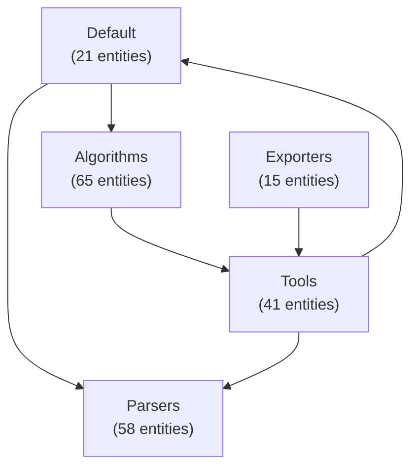

# arcade-analyze-skill

A [Claude Code](https://claude.com/claude-code) skill that recovers and
**visualizes the architecture** of a software codebase using
[arcade-agent](https://github.com/lemduc/arcade-agent) — the Python successor to
USC's ARCADE workbench (Architecture Recovery, Change, And Decay Evaluator).

Point it at a Java / Python / C / C++ project (local path or git URL) and it runs
the full pipeline — **ingest → parse → recover → detect smells → compute metrics
→ visualize** — then opens an interactive HTML report with the component diagram,
dependency graph, architectural smells, and quality metrics.

## Demo

Two real runs, both with the default `pkg` algorithm, generated by
[`examples/run_demo.sh`](examples/run_demo.sh). They show the skill across
languages — and the contrast between a clean codebase and a tangled one.

| Target | Language | Entities | Edges | Components | Smells | RCI | TurboMQ | Report |
|--------|:--------:|---------:|------:|-----------:|-------:|----:|--------:|--------|
| [arcade-agent](https://github.com/lemduc/arcade-agent) (self) | Python | 200 | 115 | 5 | 3 | **0.85** | **0.79** | [HTML](examples/arcade-agent-python.html) · [live](https://lemduc.github.io/arcade-analyze-skill/arcade-agent-python.html) |
| [arcade_core](https://github.com/usc-softarch/arcade_core) | Java | 1078 | 3520 | 13 | 6 | 0.40 | 0.26 | [HTML](examples/arcade-core-java.html) · [live](https://lemduc.github.io/arcade-analyze-skill/arcade-core-java.html) |

**Read the numbers:** arcade-agent (Python) scores high on RCI/TurboMQ — cohesive,
well-separated modules. arcade_core (Java) scores much lower and surfaces a
**9-component dependency cycle** plus a hub (`Clustering`) that 58% of components
depend on — the classic signature of a large research codebase that grew
organically.

### Architecture diagram (arcade-agent, Python)

Recovered components and their dependencies. Note the cycle
`Default → Algorithms → Tools → Default` that the skill flags as a smell:



The interactive HTML report renders this diagram, the full component/entity
breakdown, every smell with its explanation, and all six metrics. **View it live:**
<https://lemduc.github.io/arcade-analyze-skill/>

### Reproduce it

```bash
ARCADE_AGENT_HOME=/path/to/arcade-agent \
ARCADE_CORE_HOME=/path/to/arcade_core \
  ./examples/run_demo.sh
```

(`ARCADE_CORE_HOME` is optional — clone
[arcade_core](https://github.com/usc-softarch/arcade_core) to include the Java run.)

## What it does

- **Recovers** a component-level architecture via clustering (PKG, WCA, ACDC,
  ARC, LIMBO).
- **Detects** architectural smells: dependency cycles, concern overload,
  scattered functionality, link overload.
- **Computes** quality metrics: RCI, TurboMQ/BasicMQ, intra/inter-connectivity.
- **Visualizes** everything in a self-contained interactive HTML report
  (auto-opened), with optional Mermaid component diagrams.

## Install

This skill is a thin wrapper over `arcade-agent`, so you need that installed
first.

1. Install [arcade-agent](https://github.com/lemduc/arcade-agent) and create its
   virtualenv (`pip install -e ".[dev]"`).
2. Make this skill discoverable by Claude Code by symlinking it into your skills
   directory (the symlink name becomes the skill name `arcade-analyze`):

   ```bash
   git clone https://github.com/lemduc/arcade-analyze-skill.git
   ln -s "$(pwd)/arcade-analyze-skill" ~/.claude/skills/arcade-analyze
   ```

3. Tell the skill where arcade-agent lives (the wrapper checks `--arcade-home`,
   then `$ARCADE_AGENT_HOME`, then a built-in default):

   ```bash
   export ARCADE_AGENT_HOME=/path/to/arcade-agent
   ```

## Usage

In Claude Code, just ask in natural language — the skill triggers on requests
like:

- "analyze the architecture of `/path/to/repo`"
- "recover the architecture and show me the components"
- "find architectural smells / dependency cycles in this project"
- "is this codebase well-modularized?"

Or run the wrapper directly with arcade-agent's venv interpreter:

```bash
"$ARCADE_AGENT_HOME/.venv/bin/python" scripts/analyze.py /path/to/repo \
  --language java --algorithm pkg
```

### Options

| Flag | Purpose |
|------|---------|
| `--language / -l` | `java`, `python`, `c`, `cpp` (auto-detected if omitted) |
| `--algorithm / -a` | `pkg` (default), `wca`, `acdc`, `arc`, `limbo` |
| `--num-clusters / -n` | Target component count (wca/acdc/arc/limbo) |
| `--use-llm` | Semantic concern + smell analysis via the `claude` CLI |
| `--also-mermaid` | Also emit a Mermaid `.md` component diagram |
| `--output / -o` | HTML output path (default `./arcade-report/<name>-<algo>.html`) |
| `--no-open` | Don't auto-open the report |
| `--arcade-home` | Path to the arcade-agent repo |

See [`references/algorithms.md`](references/algorithms.md) for algorithm, smell,
and metric details.

## Layout

```
arcade-analyze-skill/
├── SKILL.md                  # skill definition (trigger + workflow)
├── scripts/analyze.py        # one-command pipeline wrapper
└── references/algorithms.md  # algorithm / smell / metric reference
```

## License

MIT
